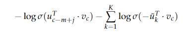

# Lecture 01 : Introduction and Word Vectors
slides [链接1](http://web.stanford.edu/class/cs224n/slides/cs224n-2019-lecture01-wordvecs1.pdf) [链接2](lecture01\cs224n-2019-lecture01-wordvecs1.pdf)

note [链接](http://web.stanford.edu/class/cs224n/readings/cs224n-2019-notes01-wordvecs1.pdf)

vedio [链接](https://youtu.be/8rXD5-xhemo)
## 1.词的表示

### 1.1 WordNet

* missing nuance 无法表示细微的差别
* missing new meaning of words 
* Subjective
* 人力
* 无法计算相似性

### 1.2 Onehot

* 维度高
* There is no natural notion of similarity for one-hot vectors! 任何两个词都是正交的，没有计算相似性的方法。

解决方法： learn to encode similarity in the vectors themselves 学习在向量本身中编码相似性

### 1.3 Word vectors

word vectors\word embeddings\word representations :distributed representation

<u>Distributional semantics</u> : A word’s meaning is given by the words that frequently appear close-by

## 2.SVD Based Methods

首先在一个大的数据集中循环计算共现矩阵X,然后对X进行奇异值分解得到$USV^T$，然后用U的行代表词的词向量。

### 2.1 Word-Document Matrix

word $i$ 出现在document $j$ 中:$X_{ij}$ 这个矩阵很大$R^{|v|*M}$，因为M非常大

### 2.2 Window based Co-occurrence Matrix

计算每个单词在一个特定大小的窗口中出现的次数

### 2.3 Applying SVD to the cooccurrence matrix

得到$X=USV^T$，第k个单词的词向量是$U$的第k列乘以$\frac{\sum_{i=1}^k \sigma _i}{\sum_{i=1}^{|V|} \sigma_i}$

很难用在大型文档

## 3.Iteration Based Methods - Word2vec

不需要全局信息，而是不断迭代，一次学习一次迭代。按照一定的目标训练模型。在每个迭代中，我们运行我们的模型，评估错误，并遵循一个更新规则，最终学习到词向量。

* Go through each position t in the text, which has a center word
c and context (“outside”) words o

*  Use the similarity of the word vectors for c and o to calculate
the probability of o given c (or vice versa) **需要再理解** 根据c和o
的相似性计算给定c得到o的概率或者相反。

*  Keep adjusting the word vectors to maximize this probability

**两种算法：**

1. Skip-grams (SG)

Predict context (”outside”) words (position independent) given centerword

2. Continuous Bag of Words (CBOW)

Predict center word from (bag of) context words

**训练方法**
1、Negative sampling
2、hierarchical softmax

### 3.1 Continuous Bag of Words Mode(CBOW)

$V、U$分别是输入、输出词向量矩阵

**steps**

1. 对上下文大小为m的生成 one hot词向量:$(x^{(c-m)},...,x^{(c+m)}\in R^{|V|})$

2. one hot词向量依次与V相乘的到词嵌入

3. 得到平均向量$\hat v=\frac{v_{c-m}+...+v_{c+m}}{2m}$

4. 生成分数向量 $z=U\hat v \in R^{|V|}$

5. 将分数转化为概率 $\hat y=softmax(z) \in R^{|V|}$

6. 希望$\hat y$匹配$y$，$y$也是一个one hot 向量。

然后我们需要一个度量$y和\hat y$距离的函数，我们采用cross entropy

$$H(\hat y,y)=-\sum_{j=1}^{|V|}y_j\log(\hat y_j)$$

所以：

$$
minimize J = -\log P(w_c|w_{c-m},...,w_{c+m}) \\
= -\log P(u_c|\hat v)\\
=-\log \frac{exp(u_c^T)}{\sum_{j=1}^{|V|}exp(u_j^T\hat v)}\\
=-u_c^T\hat v+\log \sum_{j=1}^{|V|}exp(u_j^T\hat v)
$$

### 3.2 Skip-Gram Model

中心词预测上下文，“跳转为上下文”，（Here we callthe word "jumped" the context）

**steps:**

1. 生成中心词的one hot 向量$x\in R^{|V|}$

2. 生成中心词的词嵌入 $v_c=Vx \in R^n$

3. 生成分数向量 $z=Uv_c$

4. 转为概率 $\hat y=softmax(z)$

5.希望$y与\hat y$相近

然后需要有一个目标函数，我们用贝叶斯的假设条件，给定中心字，所有输出字都是完全独立的。

所以：

$$minimize J=-\log P(w_{c-m},...,w_{c+m}|w_c)\\
=-\log \prod_{j=0,j\neq m}^{2m}P(u_{c-m+j}|v_c)\\
=-\log \prod_{j=0,j\neq m}^{2m}\frac{exp(u_{c-m+j}^T v_c)}{\sum{k=1}{|V|}exp(u_k^T v_c)}\\
-\sum_{j=0,j\neq m}{2m}u_{c-m+j}^{T}v_c+2m\log\sum_{k=1}^{|V|}exp(u_k^Tv_c)
$$

### 3.3 Negative Sampling

观察上面两个模型的目标函数，每一次迭代都要在$|V|$量的数据上计算，十分耗费时间。所以不在整个数据上计算，我们只采样在一个噪声分布$P_n(w)$进行负样本，其概率分布与词汇表频率的排序相匹配。

假设word and context $(w,c)$,$P(D=1|w,c)、P(D=0|w,c)$分别表示w与c是正样本和负样本。

假设w c是正样本的概率为：

$$P(D=1|w,c,\theta)=\sigma(v_c^T v_w)=\frac{1}{1+e^{(-v_c^T v_w)}}$$

重新定义目标函数：

对于skip-gram：

对于CBOW:

$\{\hat u_k|k=1,...,K\}$是从$P_n(w)$中采样的。那么$P_n(w)$是什么样的呢？

what seems to work best isthe Unigram Model raised to the power of 3/4.为什么是3/4呢？

### 3.4 Hierarchical Softmax

在实际应用中，对于不常用的词，Hierarchical Softmax的效果较好，而对于常用的词和低维向量，负采样效果较好。

树每个叶子节点表示一个词，

>In this model, the probability of a word w given a vector wi,P(w|wi), is equal to the probability of a random walk starting in the root and ending in the leaf node corresponding to w. cost is $O(\log|V|)$

$L(w)$ ： the number of nodes in the path from the root to the leaf w

$n(w,i)$ ： the i-th node on this path with associated vector $V_{n(w,i)}$，$n(w,1)$ 是根节点，$n(w,L(w))$是w的父亲节点。

对于每一个内部节点 inner node n,我们选择一个孩子节点ch(n)（always the left node）

所以概率为：

并且保证了
$$\sigma(v_n^T v_{w_i})+\sigma(-v_n^T v_{w_i})=1$$
$$\sum_{w=1}^{|V|}P(w|w_i)=1$$

>To train the model, our goal is still to minimize the negative loglikelihood−logP(w|wi). But instead of updating output vectors per word, we update the vectors of the nodes in the binary tree that arein the path from root to leaf node.
The speed of this method is determined by the way in which the binary tree is constructed and words are assigned to leaf nodes.Mikolov et al.  use a binary Huffman tree, which assigns frequentwords shorter paths in the tree.

### 3.5 objective function

likelihood:

$$L(\theta)=\prod_{t=1}^T\prod_{-m\leq j\leq m;j\neq 0}P(w_{t+j}|w_t;\theta)$$

objective function $J(\theta)$

$$J(\theta)=-\frac{1}{T}\log{L(\theta)}$$

最小化目标函数就是最大化预测概率

$$v_w$$ ：w is a center word
$$u_w$$ ：w is a context word

$$P(o|c)=\frac{exp(u_o^T v_c)}{\sum_{w\in V} exp(u_w^T v_c)}$$

* Exponentiation makes anything positive 幂运算使值为正
* every word has two vectors v和u向量

理解：在$w_{t+j}和w_t$知道时$P(w_{t+j}|w_t;\theta)$代表已知的这种结果不同的参数$\theta$发生这种结果的概率，使乘积最大就是最大可能的参数。$P()$是我们假设的概率分布模型。