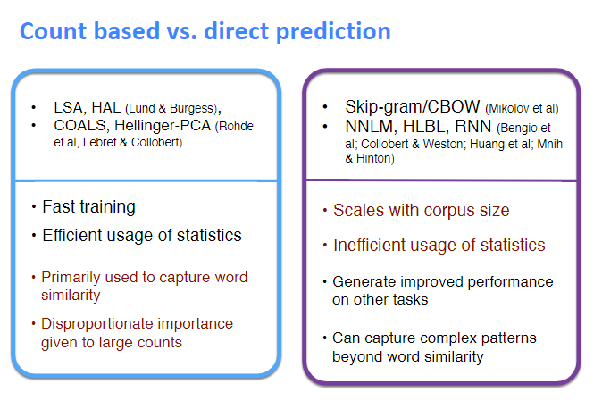

# lecture02 : Word Vectors 2 and Word Senses

## 1. word vertor and word2vec 

word2vec基本在lecture01，这里写一些补充的东西。

>Word2vec maximizes objective function by putting similar words nearby in space5

word2vec 将相似的词更加相近。

**Optimization：**

* Gradient Descent：在全部样本上 
* Stochastic Gradient Descent：对全部样本进行随机采样，在采样的样本上计算梯度。在每次更新时用1个样本。

**why two vectores?**

Easier optimization. Average both at the end

**why not capture co-occurrence counts directly**

With a co-occurrence matrix X，有两种方法，windows和document。

问题：
1. 随着词汇量的增加而增加
2. 非常高维的:需要大量的存储空间
3. 后续的分类模型存在稀疏性问题

会导致模型不那么健壮。

**解决方法**
1. 对X进行降维，比如SVD。但会有有的词太频繁了，解决方法有（1）$min(x，t) t约等于100$；（2）全部忽略; Ramped windows that count closer words more；Use Pearson correlations instead of counts, then set negative values to 0；

**Encoding meaning in vector differences**

Log-bilinear model:$w_i*w_j=\log P(i|j)$

with vector differences $w_x*(w_a-w_b)=\log\frac{P(x|a)}{P(x|b)}$

## 2. GloVe : Combining the best of both

$$J=\sum_{i,j=1}^{V}f(X_{ij})(w_i^T\tilde w_j+b_i+\tilde b_j -\log X_{ij})^2$$

优点：
* Fast training
* Scalable to huge corpora 
* Good performance even with small corpus and small vectors

### 2.1 和之前的模型进行比较

到目前为止有两种模型来获取word emdeddings。第一种是基于计数的（LSA、HAL）。虽然这些方法有效地利用了全局统计信息，但它们主要用于捕获词的相似性，而在进行词的类比、分离次优向量空间结构(indicating a sub-optimal vector space structure)等任务时表现较差。另一种是基于窗口的(skpi-gram and CBOW)，虽然有捕捉语义的能力但没有利用全局的共现信息。

Glove由一个加权最小二乘组成，训练共现信息，有效利用统计信息。

### 2.2 Co-occurrence Matrix

$X_{ij}$代表单词j出现在单词i上下文的概率。$X_i=\sum_k X_{ik}$是所有词出现在词i上下文的总数。$P_{ij}=P(w_j|w_i)=\frac{X_{ij}}{X_i}$代表j出现在i上下文的概率。

计算共现矩阵对于大规模文本需要大量计算，但是是一次的前期成本。

### 2.3 Least Squares Objective

在skip-gram模型种我们用softmax计算概率。然后计算交叉熵

$$J=-\sum_{i\in corpus}\sum_{j\in context(i)}\log Q_{ij}$$

但是相同的i和j可以共同出现多次。可以将他们合在一起提高效率。

$$J=-\sum_{i=1}^W\sum_{j=1}^W X_{ij}\log Q_{ij} $$

交叉熵损失的一个显著缺点是它要求分布Q被标准化，涉及到整个词汇量的昂贵的求和操作。所以我们使用最小二乘。

$$\hat J=\sum_{i=1}^W\sum_{j=1}^W X_{ij}(\hat P_{ij}-\hat Q_{ij})^2$$

where $\hat P_{ij}=X_{ij} and \hat Q_{i}=exp(\hat u_j^T \hat v_i)$，但是产生一个问题是X_{ij}的值经常非常大使得优化很困难，所以将$\hat P and \hat Q$对数化。

$$\hat J=\sum_{i=1}^W\sum_{j=1}^W X_{i}(\log{\hat P_{ij}}-\log{\hat Q_{ij}})^2\\
=\sum_{i=1}^W\sum_{j=1}^W X_{i}(\hat u_j^T \hat v_i-\log X_{ij})^2$$

然后观察到权重因子$X_i$不是最优的所以：

$$\hat J=\sum_{i=1}^W\sum_{j=1}^W f(X_{ij})(\hat u_j^T \hat v_i-\log X_{ij})^2$$

### 2.4 conclusion

Glove模型只对共现矩阵的非零元素进行训练，有效的利用的全局统计信息。在相同条件下比word2vec表现的更加出色。

## 3. How to evaluate word vector?

### 3.1 Intrinsic vs extrinsic

**Intrinsic:**
* 对特定的任务评估（比如类比比较）
* Fast to compute
* Helps to understand that system
* Not clear if really helpful unless correlation to real task is established

**Extrinsic**
* Evaluation on a real task
* Can take a long time to compute accuracy
* Unclear if the subsystem is the problem or its interaction or other subsystems
* If replacing exactly one subsystem with another improves accuracy --> Winning!

### 3.2 Intrinsic word vector evaluation

**方法一:Word Vector Analogies**

Word Vector Analogies：Syntactiv and Semantic

$$a:b :: c:?$$

$$d=\underset{i}{\operatorname{argmax}}\frac{(x_b-x_a+x_c)^Tx_i}{||x_b-x_a+x_c||}$$

存在的问题：如果信息是存在的但不是线性的呢

根据Intrinsic分析超参数得到：

* 最好是300维左右
* asymmetric context (only words to the left)不对称上下文 不是很好。
* window size of 8 is good for Glove
* Performance is heavily dependent on the model used for word embedding
* Performance increases with larger corpus sizes
* Performance is lower for extremely low dimensional word vectors

**方法二:Correlation Evaluation**

Word vector distances and their correlation with human judgments

Example dataset: WordSim353

## 3.3 Word senses and word sense ambiguity

每个词都有很多种意思，一个词向量是否捕获了所有的这些意思呢？有如下解决方法：

**Improving Word Representations Via Global Context And Multiple Word Prototypes**

Idea: Cluster word windows around words, retrain with each word assigned to multiple different clusters bank1, bank2.

**Linear Algebraic Structure of Word Senses, with Applications to Polysemy**

$v_pike=\alpha_1 v_{pike_1}+\alpha_2 v_{pike_2}+...$

$\alpha_1$是频率

### 3.4 Extrinsic word vector evaluation

Extrinsic evaluation of word vectors: All subsequent tasks in this class,比如命名实体识别

#### 3.4.1 Problem Formulation

对于NLP的分类问题可以公式化为：

$$\{x^{(i)},y^{(i)}\}_1^N$$

与一般问题不同的是，NLP提出了word embedding再训练的思想。

#### 3.4.2 Retraining Word Vectors

>Implementation Tip:Word vector retraining should be considered for large training datasets. For small datasets, retraining word vectors will likely worsen performance

如果我们使用外部任务对单词向量进行再训练，我们需要确保训练集足够大，能够覆盖词汇表中的大多数单词。如果训练数据集很小，就不应该对字向量进行再训练。如果训练集很大，再训练可以提高效率。

#### 3.4.3 Softmax Classification and Regularization

在N个样本点上：

$$\sum_{i=1}^N\log(\frac{exp(W_{k(i)}x)}{\sum_{c=1}^C exp(W_c x^{(i)})})$$

$k(i)$是返回$x^{(i)}$样本的正确索引值，划分为C类则需要更新的参数为$C*d+|V|*d$

$$\sum_{i=1}^N\log(\frac{exp(W_{k(i)}x)}{\sum_{c=1}^C exp(W_c x^{(i)})})+\lambda\sum_{k=1}^{C*d+|V|*d}\theta_k^2$$

#### 3.4.4 Window Classification

在大多数情况下，我们倾向于使用单词序列作为模型的输入。

## 参考资料
 1. [slides](http://web.stanford.edu/class/cs224n/slides/cs224n-2019-lecture02-wordvecs2.pdf)  
 2. [note](http://web.stanford.edu/class/cs224n/readings/cs224n-2019-notes02-wordvecs2.pdf)  
 3. [vedio](https://youtu.be/kEMJRjEdNzM)
 4. [GloVe: Global Vectors for Word Representation (original GloVe paper)](https://nlp.stanford.edu/pubs/glove.pdf)
 5. [Improving Distributional Similarity with Lessons Learned from Word Embeddings](http://www.aclweb.org/anthology/Q15-1016)
 6. [Evaluation methods for unsupervised word embeddings](http://www.aclweb.org/anthology/D15-1036)
 7. [A Latent Variable Model Approach to PMI-based Word Embeddings](http://aclweb.org/anthology/Q16-1028)
 8. [Linear Algebraic Structure of Word Senses, with Applications to Polysemy](https://transacl.org/ojs/index.php/tacl/article/viewFile/1346/320)
 9. [On the Dimensionality of Word Embedding.](https://papers.nips.cc/paper/7368-on-the-dimensionality-of-word-embedding.pdf)

 