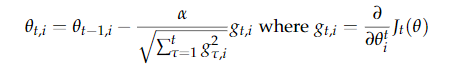

# lecture03&04:Word Window Classification, Neural Networks, and Matrix Calculus,Backpropagation and Computation Graphs
[TOC]
## 1.Classification

分类的公式表达：

$$\{x_i,y_i\}_{i=1}^N$$

$x_i$：是inputs(word2,sentences,documents)

$y_i$: 是label,可以是：

* classes: sentiment, named entities, buy/sell decision
* other words
* later: multi-word sequences

## 2.Neural network
深度学习的基础这里不再写了
### 2.1 Maximum Margin Objective Function
对于正样本和负样本，我们常常希望目标函数正样本的分数越小，负样本的分数越小，所以希望$minimize(s_c-s)$，但是我们这个式子的意义是正样本的分数要比负样本的分数高而不关心其他。因此改为：

$$minimize J=max(S_c-s,0)$$

这个式子的意义在于让正样本的分数大于负样本的分数，而不管数值大多少。但是这样没有建立一个安全区域。所以改为：

$$minimize J=max(\Delta+s_c-s,0)$$

### 2.2 Neural Networks Tips and Tricks
#### 2.2.1 Gradient Check

精度不高，不能直接用来训练，但是可以用来检查导数的正确性。

**centered difference formula**
$$J'(\theta)\approx\frac{J(\theta^{(i+)})-J(\theta^{(i-)})}{2\epsilon}$$

#### 2.2.2 Regularization
L1、L2正则化，常常用L2正则化。不对bias不做正则化。
>首先正则化主要是为了防止过拟合，而过拟合一般表现为模型对于输入的微小改变产生了输出的较大差异，这主要是由于有些参数w过大的关系，通过对||w||进行惩罚，可以缓解这种问题。
>
>而如果对||b||进行惩罚，其实是没有作用的，因为在对输出结果的贡献中，参数b对于输入的改变是不敏感的，不管输入改变是大还是小，参数b的贡献就只是加个偏置而已。举个例子，如果你在训练集中，w和b都表现得很好，但是在测试集上发生了过拟合，b是不背这个锅的，因为它对于所有的数据都是一视同仁的（都只是给它们加个偏置），要背锅的是w，因为它会对不同的数据产生不一样的加权。
>
>或者说，模型对于输入的微小改变产生了输出的较大差异，这是因为模型的“曲率”太大，而模型的曲率是由w决定的，b不贡献曲率（对输入进行求导，b是直接约掉的）。
————————————————
版权声明：本文为CSDN博主「seashell_9」的原创文章，遵循 CC 4.0 BY-SA 版权协议，转载请附上原文出处链接及本声明。
原文链接：https://blog.csdn.net/seashell_9/article/details/89342627

#### 2.2.3 Dropout

前向传播以p概率丢失，测试时乘以p。为了结果不依赖与某几条路径。

#### 2.2.4 Neuron Units

**Sigmoid**

$$\sigma(z)=\frac{1}{1+exp(-z)}$$

**Tanh**

$$tanh(z)=\frac{exp(z)-exp(-z)}{exp(z)+exp(-z)}$$

**Hard tanh**

$$hardtanh=
\begin{cases}
-1:z<-1 \\
z:-1<z<1\\
1:z>1
\end{cases}$$

**soft sign**

$$softsign(z)=\frac{z}{1+|z|}$$

**ReLU**

$$rect(z)=max(z,0)$$

**Leaky Relu**
$$leaky(z)=max(z,k*z)$$

#### 2.2.5 Data Preprocessing

**Mean Subtraction**

减去均值

**Normalization**

归一化

**Whitening**


#### 2.2.6 Parameter Initialization

一个好的初始化策略是将权值初始化为通常分布在0附近的小随机数.

$$W\sim U[-\sqrt{-\frac{6}{n^{(l)}+n^{l+1}}},\sqrt{\frac{6}{n^{(l)}+n^{l+1}}}]$$

#### 2.2.7 Learning Strategies

$$\theta^{new}=\theta^{old}-\alpha\nabla J_t(\theta)$$

那么$\alpha$怎么确定呢？

$$\alpha(t)=\frac{\alpha _0 \tau}{max(t,\tau)}$$

$\alpha _0$初始学习率，$\tau$开始降低的时间。

#### 2.2.8 Momentum Updates

```
# Computes a standard momentum update
# on parameters 
v = mu*v - alpha*grad_x
x += v
```

#### 2.2.9 Adaptive Optimization Methods



```
# Assume the gradient dx and parameter vecto
cache += dx**2
x += - learning_rate*dx / np.sqrt(cache + 1e-8)
```

**RMSProp**
```
# Update rule for RMS prop
cache = decay_rate*cache + (1 - decay_rate)*dx**2
x += - learning_rate*dx / (np.sqrt(cache) + eps)
```

**Adam**
```
# Update rule for Ada
m = beta1*m + (1-beta1)*dx
v = beta2*v + (1-beta2)*(dx**2)
x += - learning_rate*m / (np.sqrt(v) + eps)
```

## 3.Named Entity Recongnition（NER）

### 3.1 NER介绍
下面介绍了NER的任务和目的，以及做完NER后可用来做知识提取。

>The task: findand classifynames in text
>
>Possible purposes:
>* Tracking mentions of particular entities in documents
>* For question answering, answers are usually named entities
>* A lot of wanted information is really associations between named entities
>* The same techniques can be extended to other slot-filling classifications
>
>Often followed by Named Entity Linking/Canonicalization into Knowledge Base

### 3.2 编码方式：

1、BIO encoding:

B-ORG、I-ORG、O ，实体的第一个词：B-实体类别，后面的词：I-实体类别，其他词：O。

### 3.3 Window classification

思想：用上下文窗口来分类一个词，而不单单用单个词，因为会有歧义等问题。（classify a word in its context window of neighboring words.）


1、一个简单的方法平均上下文词向量，但问题是会丢失位置信息。

2、还有可以将上下文向量连接起来，比如对于窗口长度为2的$x_{window}=x\in R^{5d}$，然后用softmax，在用cross entropy error.

$$\hat y_y=p(y|x)=\frac{exp(W_y x)}{\sum_{c=1}^C exp(W_c x)}$$

3、Binary classification with unnormalized scores

使用神经激活来给出一个非标准化的分数

$$score(x)=U^Ta \in R$$
$$s=U^T f(Wx+b)$$

然后神经网络中间层学习输入字向量之间的非线性交互。用the max-margin loss 使真实窗口的分数变大，假的窗口的分数变小。

$$J=max(0,1-s+s_c)$$

$s:$ 真实窗口

$s_c:$ 假的窗口

这样的目标函数可以使每个中心有NER位置的窗口的得分应该比中心没有位置的窗口高+1，对于完整的目标函数采样几个负样本与一个真实样本，与word2vec负采样相似。

### 3.4 Gradients

#### 3.4.1 Jacobian Matrix

$$(\frac{\partial f}{\partial x})_{ij}=\frac{f_i}{\partial x_j}=\begin{cases}
f'(x_i), i=j \\
0, otherwise
\end{cases}
=diag(f'(x))$$

#### 3.4.2 Neural Net
$$S=u^Th$$
$$h=f(z)$$
$$z=Wx+b$$
$$x(input)$$

**$\frac{\partial s}{\partial b}$的计算**

$$\frac{\partial s}{\partial b}=\frac{\partial s}{\partial h}*\frac{\partial h}{\partial z}*\frac{\partial z}{\partial b}=u^T diag(f'(z))I=u^T f'(Z)$$

$$\delta=\frac{\partial s}{\partial h}*\frac{\partial h}{\partial z}=u^Tf'(z)$$

$\delta$ is local error signal

**$\frac{\partial s}{\partial W}$的计算**'

$$\frac{\partial s}{\partial W}=\frac{\partial s}{\partial h}*\frac{\partial h}{\partial z}*\frac{\partial z}{\partial W}=\delta*\frac{\partial z}{\partial W}$$

$W\in R^{n*m}$所以$\frac{\partial s}{\partial W}\in R^{n*m}$

所以上式改为:

$$\frac{\partial s}{\partial W}=\delta^Tx^T$$
$$[n*m]=[n*1][1*m]$$

>two options:
>1.Use Jacobianform as much as possible, reshape to follow the convention at the end
>2.Always follow the convention


Q1:链式法则为什么导致不一致需要转置？？？

## 参考资料
 1. [slides](http://web.stanford.edu/class/cs224n/slides/cs224n-2019-lecture03-neuralnets.pdf) 
 2. [matrix calculus notes](http://web.stanford.edu/class/cs224n/readings/gradient-notes.pdf)
 3. [note](http://web.stanford.edu/class/cs224n/readings/cs224n-2019-notes03-neuralnets.pdf)
 4. [vedio](https://youtu.be/8CWyBNX6eDo)
 5. [CS231n notes on backprop](http://cs231n.github.io/optimization-2/)
 6. [Review of differential calculus](http://web.stanford.edu/class/cs224n/readings/review-differential-calculus.pdf)
 7. [Natural Language Processing (Almost) from Scratch](http://www.jmlr.org/papers/volume12/collobert11a/collobert11a.pdf)
 8. [assignment 2参考答案](https://blog.csdn.net/lrs1353281004/article/details/89449978)
 9. [assignment 2编程参考](https://github.com/lrs1353281004/CS224n_winter2019_notes_and_assignments/tree/master/homework_my_solution/homework2)
 10. [slides04](http://web.stanford.edu/class/cs224n/slides/cs224n-2019-lecture04-backprop.pdf)
 11. [CS231n notes on network architectures](http://cs231n.github.io/neural-networks-1/)
 12. [Learning Representations by Backpropagating Errors](http://www.iro.umontreal.ca/~vincentp/ift3395/lectures/backprop_old.pdf)
 13. [Derivatives, Backpropagation, and Vectorization](http://cs231n.stanford.edu/handouts/derivatives.pdf)
 14. [Yes you should understand backprop](https://medium.com/@karpathy/yes-you-should-understand-backprop-e2f06eab496b)


