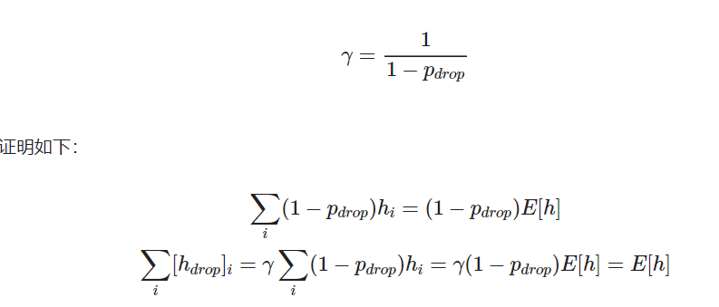
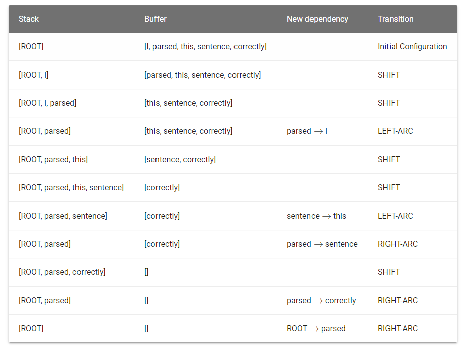

**1.a.i**
1.超参数$\lambda_1$一般设置为0.9，所以对于移动平均的梯度值m而言，主要受到的是之前的梯度的移动平均值的影响，即使梯度爆炸，影响也会减轻。
2.减小梯度的变化程度，可以使得每次梯度更新更加稳定。

**1.a.ii**
1.移动平均梯度最小的模型参数将得到较大的更新。
2.一方面，将梯度较小的参数的更新变大，帮助其走出局部最优点（鞍点）；另一方面，将梯度较大的参数的更新变小，使其更新更加稳定。结合以上两个方面，使学习更加快速的同时也更加稳定。

**1.b.i**

**1.b.ii**
如果我们在评估期间应用 dropout ，那么评估结果将会具有随机性，并不能体现模型的真实性能，违背了正则化的初衷。通过在评估期间禁用 dropout，从而观察模型的性能与正则化的效果，保证模型的参数得到正确的更新。

**2.a**

**2.b**
需要2*n步才能完成解析。n步SHIFT和n步LEFT-ARC 或 RIGHT-ARC 操作。
