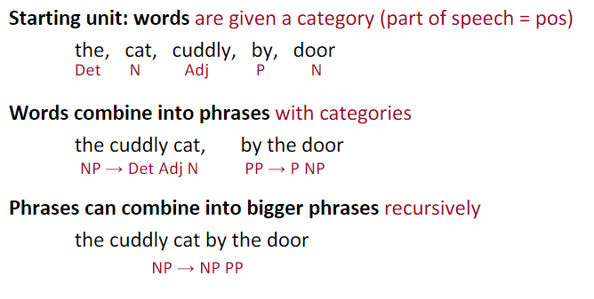
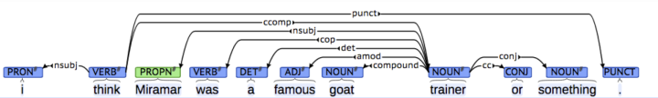
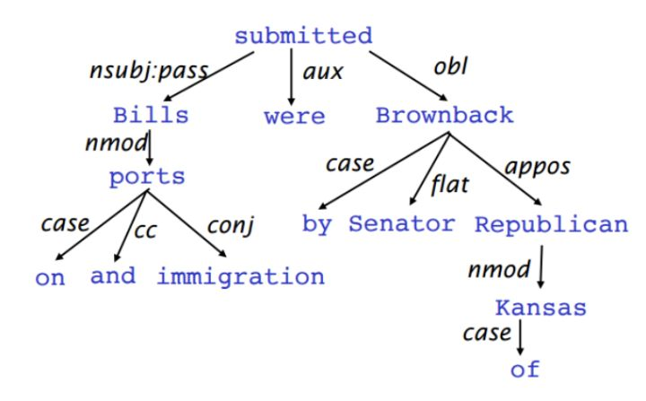
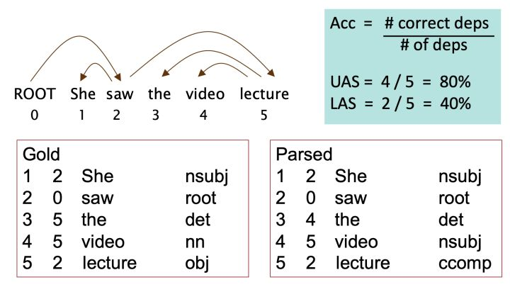
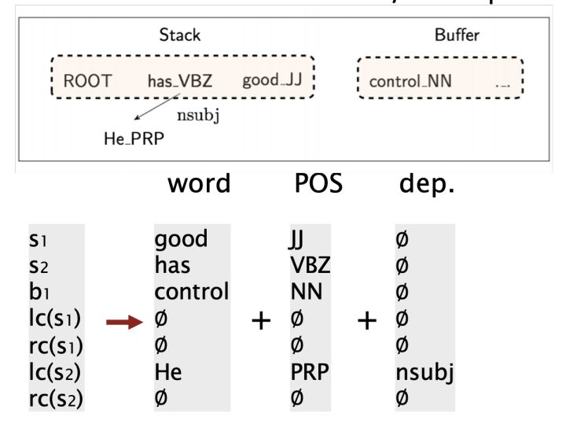
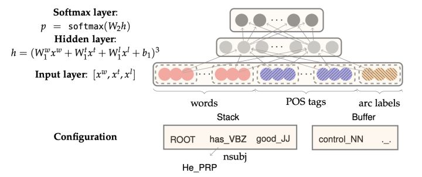

# lecture05:Linguistic Structure: Dependency Parsing(语言结构:依赖性解析)

# 1.Two views of linguistic structure

对于句法结构(syntactic structure)分析，主要有两种方式：Constituency Parsing与Dependency Parsing。

## 1.1 Constituency Parsing

Phrase structure organizes words into nested constituents(短语结构将单词组织成嵌套的成分)

其主要步骤是先对每个词做词性分析part of speech, 简称POS，然后再将其组成短语，再将短语不断递归构成更大的短语。

例如，对于 the cuddly cat by the door, 先做POS分析，the是限定词，用Det(Determiner)表示，cuddly是形容词，用Adj(Adjective)代表，cat和door是名词，用N(Noun)表示, by是介词，用P(Preposition)表示。

然后the cuddly cat构成名词短语NP(Noun Phrase)，这里由Det(the)+Adj(cuddly)+N(cat)构成，by the door构成介词短语PP(Preposition Phrase), 这里由P(by)+NP(the door)构成。

最后，整个短语the cuddly cat by the door 是NP，由NP（the cuddly cat）+ PP(by the door)构成。

words->the、cat、cuddly、by、door
phrases->the、cuddly、cat、by the door
bigger phrases->the cuddly cat by the door

## 1.2 Dependency Parsing
Dependency Structure展示了词语之间的依赖关系,通常用箭头表示其依存关系，有时也会在箭头上标出其具体的语法关系，如是主语还是宾语关系等。

Dependency Structure有两种表现形式，一种是直接在句子上标出依存关系箭头及语法关系，如：

另一种是将其做成树状机构（Dependency Tree Graph）

Dependency Parsing可以看做是给定输入句子$S=w_0w_1...w_n$（$w_0$是fake root，是句子中每一个词都依赖另一个节点），构建的一个有效方法就是Transition-based Dependency Parsing。

### 1.2.1 Transition-based Dependency Parsing

约束：1、只有一个词可以依赖于假根。2、不能形成一个依赖环。

Transition-based Dependency Parsing可以看做是state machine，对于$S=w_0w_1...w_n$，state由三部分构成$(\sigma,\beta,A)$,$\sigma$是S中若干$w_i$构成stack,$\beta$是S中若干$w_i$构成的buffer，$A$是dependency arc构成的集合，每一条边的形式是$(w_i,r,w_j)$，其中r描述了节点的依存关系。

初始状态时， $\sigma$ 仅包含ROOT $w_0$ ， $\beta$ 包含了所有的单词 $w_0w_1...w_n$ ，而 $A$ 是空集 。最终的目标是$\sigma$ 包含ROOT $w_0$， $\beta$ 清空，而 $A$ 包含了所有的dependency arc，  就是我们想要的描述Dependency的结果。

state之间的transition有三类：
* SHIFT：将buffer中的第一个词移出并放到stack上。
* LEFT-ARC：将 $(w_j,r,w_i)$ 加入边的集合 $A$ ，其中 $w_i$ 是stack上的次顶层的词， $w_j$ 是stack上的最顶层的词。$\sigma$中去掉$w_i$。

RIGHT-ARC:将 $(w_i,r,w_j)$ 加入边的集合 $A$ ，其中 $w_i$ 是stack上的次顶层的词， $w_j$ 是stack上的最顶层的词。$\sigma$中去掉$w_i$

我们不断的进行上述三类操作，直到从初始态达到最终态。在每个状态下如何选择哪种操作呢？当我们考虑到LEFT-ARC与RIGHT-ARC各有|R|（|R|为r的类的个数）种class，我们可以将其看做是class数为2|R|+1的分类问题，可以用SVM等传统机器学习方法解决。

**Evaluation**

我们有两个metric，一个是LAS（labeled attachment score）即只有arc的箭头方向以及语法关系均正确时才算正确，以及UAS（unlabeled attachment score）即只要arc的箭头方向正确即可。

### 1.2.2 Neural Dependency Parsing
传统的Transition-based Dependency Parsing对feature engineering要求较高，我们可以用神经网络来减少human labor。

对于Neural Dependency Parser，其输入特征通常包含三种：
* stack和buffer中的单词及其dependent word。
* 单词的Part-of-Speech tag。
* 描述语法关系的arc label。

我们将其转换为embedding vector并将它们联结起来作为输入层，再经过若干非线性的隐藏层，最后加入softmax layer得到每个class的概率。

## 参考资料
1. [slides](https://web.stanford.edu/class/archive/cs/cs224n/cs224n.1194/slides/cs224n-2019-lecture05-dep-parsing.pdf)
2.[scrawled-on slides](https://web.stanford.edu/class/archive/cs/cs224n/cs224n.1194/slides/cs224n-2019-lecture05-dep-parsing-scrawls.pdf)
3.[video](https://youtu.be/nC9_RfjYwqA)
4.[notes](https://web.stanford.edu/class/archive/cs/cs224n/cs224n.1194/readings/cs224n-2019-notes04-dependencyparsing.pdf)
5.[Incrementality in Deterministic Dependency Parsing](https://www.aclweb.org/anthology/W/W04/W04-0308.pdf)
6.[A Fast and Accurate Dependency Parser using Neural Networks](http://cs.stanford.edu/people/danqi/papers/emnlp2014.pdf)
7.[Dependency Parsing](http://www.morganclaypool.com/doi/abs/10.2200/S00169ED1V01Y200901HLT002)
8.[Globally Normalized Transition-Based Neural Networks](https://arxiv.org/pdf/1603.06042.pdf)
9.[Universal Stanford Dependencies: A cross-linguistic typology](http://nlp.stanford.edu/~manning/papers/USD_LREC14_UD_revision.pdf)
10.[Universal Dependencies website](http://universaldependencies.org/)